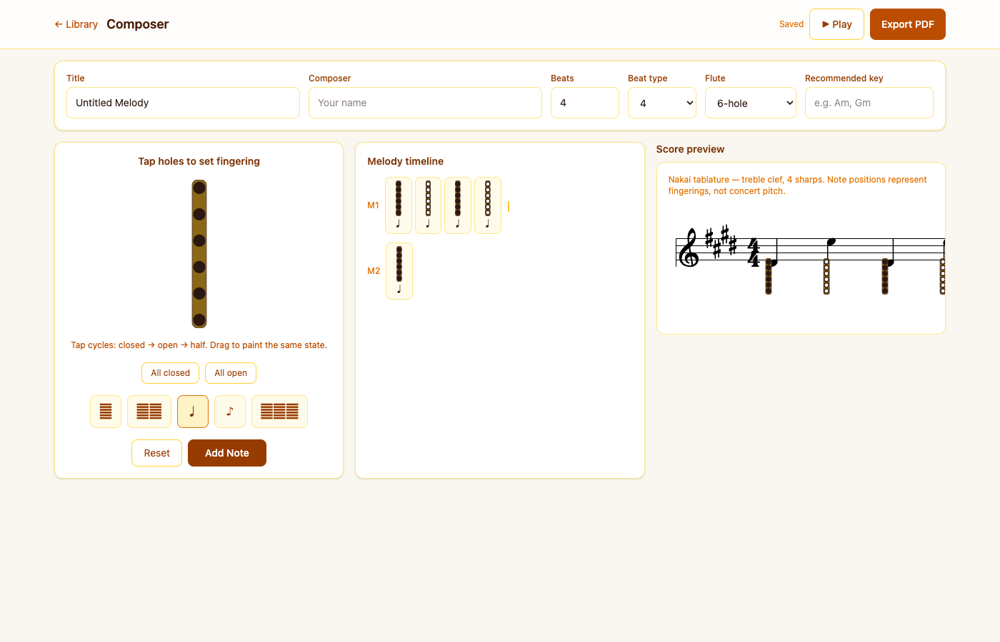

# NA Flute Composer

A web app for Native American flute players to compose and capture melodies using **Nakai tablature** and finger-hole diagrams — replacing paper sketching with an easy UI and PDF export.



## Features

- Tap finger holes on a visual flute to enter fingerings
- Live Nakai staff preview (treble clef, 4 sharps) with finger diagrams below each note
- Melody timeline with measure grouping
- Auto-save to IndexedDB (works offline as a PWA)
- Export shareable PDF scores

## Development

```bash
pnpm install
pnpm dev
```

## Build

```bash
pnpm build
pnpm preview
```

## Notation

This app follows the de facto Nakai tablature standard: note positions on the staff represent fingerings (intervals from the fundamental), not concert pitch, so the same sheet works on any pentatonic minor flute.
